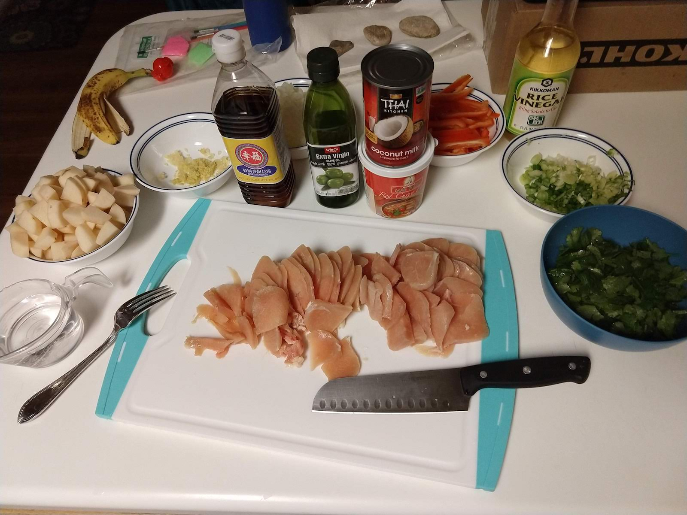

This recipe is a bit of a mashup of the following sources:

* http://makingthymeforhealth.com/one-pot-vegetable-thai-red-curry/
* https://www.lettyskitchen.com/quick-and-easy-potatoes-in-coconut-red-curry-sauce/
* https://www.epicurious.com/recipes/food/views/thai-chicken-curry-51140410
* https://cookieandkate.com/2015/thai-red-curry-recipe/
* https://damndelicious.net/2018/02/25/easy-thai-red-curry/

Here's a photo of everything we used in the recipe (banana not necessary, though helpful for pre-meal snacking):

